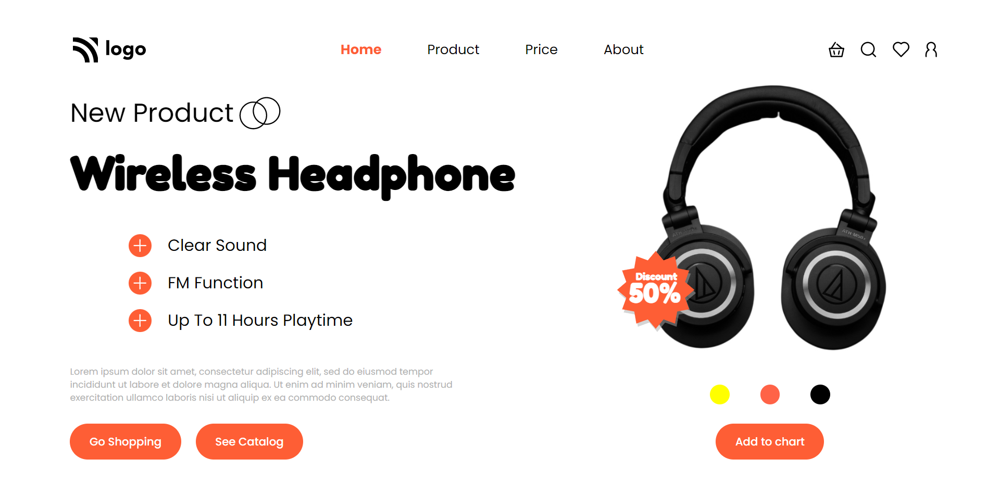

# Assignment 1

## Project 7 [Live Link](https://product-og.netlify.app)

-   Skills Gained in this project
    -   Gained indepth knowledge of flexbox.
    -   Learned to proper structure the css files.
---

## Time taken to finish this project

-   Approximately 4-5 hour taken to complete this one.

#### Screenshot

